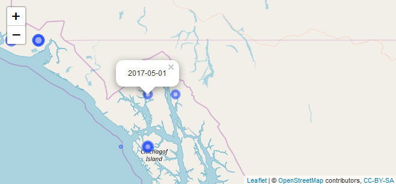
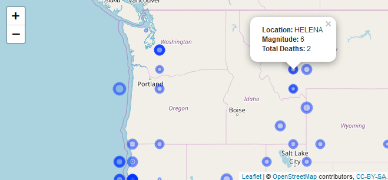

<!-- README.md is generated from README.Rmd. Please edit that file -->
[](https://travis-ci.com/seewilds/timelineR)

```{r setup, include = TRUE, echo=FALSE}
knitr::opts_chunk$set(
  collapse = TRUE,
  comment = "#>"
)
```

## timelineR README

timelineR is an extension of the ggplot2 package, dedicated to the plotting of timeline data.It also includes dedicated download and ceaning functions for the NOAA database of hurricanes.

## Download and Cleaning

***download_sed()*** downloads the NOAA database of hurricanes as a data frame.

```{r, eval = FALSE, collapse=TRUE}
all_hurricanes <- download_sed()
head(str(all_hurricanes))
```

***eq_clean_data()*** cleans the NOAA data frame by converting the LATTITUDE and LONGITUDE columns to integers, and creates a dedicated DATE column.

```{r, eval = FALSE, collapse=TRUE}
all_hurricanes_clean <- eq_clean_data(all_hurricanes)
str(all_hurricanes_clean)
```

***eq_location_clean()*** cleans the Location column of the NOAA data frame.

```{r, eval = FALSE, collapse=TRUE}
final_hurricanes <- eq_location_clean(all_hurricanes_clean)
str(final_hurricanes)
```

## geom_timeline

***geom_timeline()*** creates a ggplot object that plots instances of an event
over time.

```{r, eval = FALSE, collapse=TRUE}
usa_hurricanes <- final_hurricanes%>%filter(COUNTRY == "USA")
usa_plot <- ggplot(data = usa_hurricanes, aes(DATE, COUNTRY)) 
usa_plot + geom_timeline(aes(xmin =as.Date("1990-01-01"))) +
theme_timeline()
```


## geom_timeline_label

***geom_timeline_label()*** generates labels for the plotted event instances.

```{r, eval = FALSE, collapse=TRUE}
data <- final_hurricanes%>%filter(COUNTRY%in%c("USA", "CANADA", "CHINA", "INDIA"))
country_plot <- ggplot(data, aes(DATE, COUNTRY)) 
country_plot <- country_plot + geom_timeline(aes(xmin =as.Date("1990-01-01"), size = EQ_PRIMARY, fill = TOTAL_DEATHS)) 
country_plot <- country_plot + geom_timeline_label(aes(xmin =as.Date("1990-01-01"), label = LOCATION_NAME, n_max = 10, n_max_arrange = EQ_PRIMARY))
country_plot <- country_plot + theme_timeline()
```


## Leaflet Mapping

***eq_map()*** generates a leaflet map of locations of the NOAA hurricanes.

```{r, eval = FALSE, collapse=TRUE}
eq_map(usa_hurricanes, annot_col = 'DATE')
```


***eq_create_label()*** generates an annotation column in the NOAA data frame
for use within the leaflet map.



```{r, eval = FALSE, collapse=TRUE}
usa_hurricanes%>%eq_create_label(.)%>%eq_map(annot_col = 'popup_text')
```