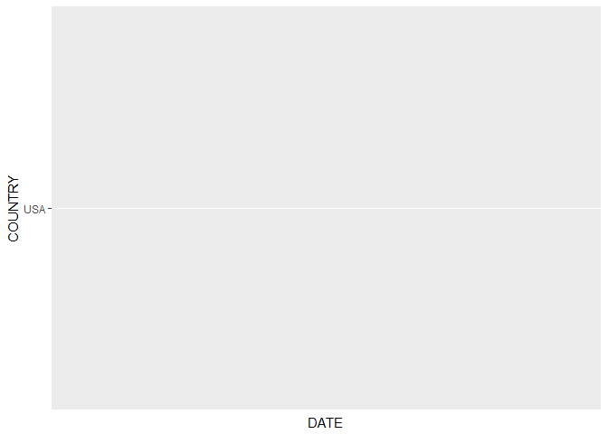

<!-- README.md is generated from README.Rmd. Please edit that file -->
``` r
library(devtools)
library(ggplot2)
library(leaflet)
library(dplyr)
library(grid)
load_all()
```

timelineR README
----------------

timelineR is an extension of the ggplot2 package, dedicated to the plotting of timeline data.It also includes dedicated download and ceaning functions for the NOAA database of hurricanes.

Download and Cleaning
---------------------

***download\_sed()*** downloads the NOAA database of hurricanes as a data frame.

``` r
all_hurricanes <- download_sed()
head(str(all_hurricanes))
#> 'data.frame':    6039 obs. of  47 variables:
#>  $ I_D                               : int  1 3 2 5877 8 11 9712 12 13 14 ...
#>  $ FLAG_TSUNAMI                      : chr  "" "" "Tsu" "Tsu" ...
#>  $ YEAR                              : int  -2150 -2000 -2000 -1610 -1566 -1450 -1365 -1250 -1050 -759 ...
#>  $ MONTH                             : int  NA NA NA NA NA NA NA NA NA NA ...
#>  $ DAY                               : int  NA NA NA NA NA NA NA NA NA NA ...
#>  $ HOUR                              : int  NA NA NA NA NA NA NA NA NA NA ...
#>  $ MINUTE                            : int  NA NA NA NA NA NA NA NA NA NA ...
#>  $ SECOND                            : num  NA NA NA NA NA NA NA NA NA NA ...
#>  $ FOCAL_DEPTH                       : int  NA 18 NA NA NA NA NA NA NA NA ...
#>  $ EQ_PRIMARY                        : num  7.3 7.1 NA NA NA NA NA 6.5 6.2 NA ...
#>  $ EQ_MAG_MW                         : num  NA NA NA NA NA NA NA NA NA NA ...
#>  $ EQ_MAG_MS                         : num  NA 7.1 NA NA NA NA NA NA NA NA ...
#>  $ EQ_MAG_MB                         : num  NA NA NA NA NA NA NA NA NA NA ...
#>  $ EQ_MAG_ML                         : num  NA NA NA NA NA NA NA NA NA NA ...
#>  $ EQ_MAG_MFA                        : num  NA NA NA NA NA NA NA NA NA NA ...
#>  $ EQ_MAG_UNK                        : num  7.3 NA NA NA NA NA NA 6.5 6.2 NA ...
#>  $ INTENSITY                         : int  NA 10 10 NA 10 10 NA NA NA 11 ...
#>  $ COUNTRY                           : chr  "JORDAN" "TURKMENISTAN" "SYRIA" "GREECE" ...
#>  $ STATE                             : chr  "" "" "" "" ...
#>  $ LOCATION_NAME                     : chr  "JORDAN:  BAB-A-DARAA,AL-KARAK" "TURKMENISTAN:  W" "SYRIA:  UGARIT" "GREECE:  THERA ISLAND (SANTORINI)" ...
#>  $ LATITUDE                          : num  31.1 38 35.7 36.4 31.5 ...
#>  $ LONGITUDE                         : num  35.5 58.2 35.8 25.4 35.3 25.5 35.8 35.5 35 35.5 ...
#>  $ REGION_CODE                       : int  140 40 130 130 140 130 140 140 140 140 ...
#>  $ DEATHS                            : int  NA 1 NA NA NA NA NA NA NA NA ...
#>  $ DEATHS_DESCRIPTION                : int  NA 1 3 NA NA NA NA NA NA NA ...
#>  $ MISSING                           : int  NA NA NA NA NA NA NA NA NA NA ...
#>  $ MISSING_DESCRIPTION               : int  NA NA NA NA NA NA NA NA NA NA ...
#>  $ INJURIES                          : int  NA NA NA NA NA NA NA NA NA NA ...
#>  $ INJURIES_DESCRIPTION              : int  NA NA NA NA NA NA NA NA NA NA ...
#>  $ DAMAGE_MILLIONS_DOLLARS           : num  NA NA NA NA NA NA NA NA NA NA ...
#>  $ DAMAGE_DESCRIPTION                : int  3 1 NA NA 3 NA 3 3 3 3 ...
#>  $ HOUSES_DESTROYED                  : int  NA NA NA NA NA NA NA NA NA NA ...
#>  $ HOUSES_DESTROYED_DESCRIPTION      : int  NA 1 NA NA NA NA NA NA NA NA ...
#>  $ HOUSES_DAMAGED                    : int  NA NA NA NA NA NA NA NA NA NA ...
#>  $ HOUSES_DAMAGED_DESCRIPTION        : int  NA NA NA NA NA NA NA NA NA NA ...
#>  $ TOTAL_DEATHS                      : int  NA 1 NA NA NA NA NA NA NA NA ...
#>  $ TOTAL_DEATHS_DESCRIPTION          : int  NA 1 3 3 NA NA NA NA NA NA ...
#>  $ TOTAL_MISSING                     : int  NA NA NA NA NA NA NA NA NA NA ...
#>  $ TOTAL_MISSING_DESCRIPTION         : int  NA NA NA NA NA NA NA NA NA NA ...
#>  $ TOTAL_INJURIES                    : int  NA NA NA NA NA NA NA NA NA NA ...
#>  $ TOTAL_INJURIES_DESCRIPTION        : int  NA NA NA NA NA NA NA NA NA NA ...
#>  $ TOTAL_DAMAGE_MILLIONS_DOLLARS     : num  NA NA NA NA NA NA NA NA NA NA ...
#>  $ TOTAL_DAMAGE_DESCRIPTION          : int  NA 1 NA 3 NA NA 3 NA NA NA ...
#>  $ TOTAL_HOUSES_DESTROYED            : int  NA NA NA NA NA NA NA NA NA NA ...
#>  $ TOTAL_HOUSES_DESTROYED_DESCRIPTION: int  NA 1 NA NA NA NA NA NA NA NA ...
#>  $ TOTAL_HOUSES_DAMAGED              : int  NA NA NA NA NA NA NA NA NA NA ...
#>  $ TOTAL_HOUSES_DAMAGED_DESCRIPTION  : int  NA NA NA NA NA NA NA NA NA NA ...
#> NULL
```

***eq\_clean\_data()*** cleans the NOAA data frame by converting the LATTITUDE and LONGITUDE columns to integers, and creates a dedicated DATE column.

``` r
all_hurricanes_clean <- eq_clean_data(all_hurricanes)
str(all_hurricanes_clean)
#> 'data.frame':    6039 obs. of  48 variables:
#>  $ I_D                               : int  1 3 2 5877 8 11 9712 12 13 14 ...
#>  $ FLAG_TSUNAMI                      : chr  "" "" "Tsu" "Tsu" ...
#>  $ YEAR                              : int  -2150 -2000 -2000 -1610 -1566 -1450 -1365 -1250 -1050 -759 ...
#>  $ MONTH                             : int  1 1 1 1 1 1 1 1 1 1 ...
#>  $ DAY                               : int  1 1 1 1 1 1 1 1 1 1 ...
#>  $ HOUR                              : int  NA NA NA NA NA NA NA NA NA NA ...
#>  $ MINUTE                            : int  NA NA NA NA NA NA NA NA NA NA ...
#>  $ SECOND                            : num  NA NA NA NA NA NA NA NA NA NA ...
#>  $ FOCAL_DEPTH                       : int  NA 18 NA NA NA NA NA NA NA NA ...
#>  $ EQ_PRIMARY                        : num  7.3 7.1 NA NA NA NA NA 6.5 6.2 NA ...
#>  $ EQ_MAG_MW                         : num  NA NA NA NA NA NA NA NA NA NA ...
#>  $ EQ_MAG_MS                         : num  NA 7.1 NA NA NA NA NA NA NA NA ...
#>  $ EQ_MAG_MB                         : num  NA NA NA NA NA NA NA NA NA NA ...
#>  $ EQ_MAG_ML                         : num  NA NA NA NA NA NA NA NA NA NA ...
#>  $ EQ_MAG_MFA                        : num  NA NA NA NA NA NA NA NA NA NA ...
#>  $ EQ_MAG_UNK                        : num  7.3 NA NA NA NA NA NA 6.5 6.2 NA ...
#>  $ INTENSITY                         : int  NA 10 10 NA 10 10 NA NA NA 11 ...
#>  $ COUNTRY                           : chr  "JORDAN" "TURKMENISTAN" "SYRIA" "GREECE" ...
#>  $ STATE                             : chr  "" "" "" "" ...
#>  $ LOCATION_NAME                     : chr  "JORDAN:  BAB-A-DARAA,AL-KARAK" "TURKMENISTAN:  W" "SYRIA:  UGARIT" "GREECE:  THERA ISLAND (SANTORINI)" ...
#>  $ LATITUDE                          : int  31 38 35 36 31 35 35 32 29 33 ...
#>  $ LONGITUDE                         : int  35 58 35 25 35 25 35 35 35 35 ...
#>  $ REGION_CODE                       : int  140 40 130 130 140 130 140 140 140 140 ...
#>  $ DEATHS                            : int  NA 1 NA NA NA NA NA NA NA NA ...
#>  $ DEATHS_DESCRIPTION                : int  NA 1 3 NA NA NA NA NA NA NA ...
#>  $ MISSING                           : int  NA NA NA NA NA NA NA NA NA NA ...
#>  $ MISSING_DESCRIPTION               : int  NA NA NA NA NA NA NA NA NA NA ...
#>  $ INJURIES                          : int  NA NA NA NA NA NA NA NA NA NA ...
#>  $ INJURIES_DESCRIPTION              : int  NA NA NA NA NA NA NA NA NA NA ...
#>  $ DAMAGE_MILLIONS_DOLLARS           : num  NA NA NA NA NA NA NA NA NA NA ...
#>  $ DAMAGE_DESCRIPTION                : int  3 1 NA NA 3 NA 3 3 3 3 ...
#>  $ HOUSES_DESTROYED                  : int  NA NA NA NA NA NA NA NA NA NA ...
#>  $ HOUSES_DESTROYED_DESCRIPTION      : int  NA 1 NA NA NA NA NA NA NA NA ...
#>  $ HOUSES_DAMAGED                    : int  NA NA NA NA NA NA NA NA NA NA ...
#>  $ HOUSES_DAMAGED_DESCRIPTION        : int  NA NA NA NA NA NA NA NA NA NA ...
#>  $ TOTAL_DEATHS                      : int  NA 1 NA NA NA NA NA NA NA NA ...
#>  $ TOTAL_DEATHS_DESCRIPTION          : int  NA 1 3 3 NA NA NA NA NA NA ...
#>  $ TOTAL_MISSING                     : int  NA NA NA NA NA NA NA NA NA NA ...
#>  $ TOTAL_MISSING_DESCRIPTION         : int  NA NA NA NA NA NA NA NA NA NA ...
#>  $ TOTAL_INJURIES                    : int  NA NA NA NA NA NA NA NA NA NA ...
#>  $ TOTAL_INJURIES_DESCRIPTION        : int  NA NA NA NA NA NA NA NA NA NA ...
#>  $ TOTAL_DAMAGE_MILLIONS_DOLLARS     : num  NA NA NA NA NA NA NA NA NA NA ...
#>  $ TOTAL_DAMAGE_DESCRIPTION          : int  NA 1 NA 3 NA NA 3 NA NA NA ...
#>  $ TOTAL_HOUSES_DESTROYED            : int  NA NA NA NA NA NA NA NA NA NA ...
#>  $ TOTAL_HOUSES_DESTROYED_DESCRIPTION: int  NA 1 NA NA NA NA NA NA NA NA ...
#>  $ TOTAL_HOUSES_DAMAGED              : int  NA NA NA NA NA NA NA NA NA NA ...
#>  $ TOTAL_HOUSES_DAMAGED_DESCRIPTION  : int  NA NA NA NA NA NA NA NA NA NA ...
#>  $ DATE                              : Date, format: "1970-01-02" "1970-01-02" ...
```

***eq\_location\_clean()*** cleans the Location column of the NOAA data frame.

``` r
final_hurricanes <- eq_location_clean(all_hurricanes_clean)
str(final_hurricanes)
#> 'data.frame':    6039 obs. of  48 variables:
#>  $ I_D                               : int  1 3 2 5877 8 11 9712 12 13 14 ...
#>  $ FLAG_TSUNAMI                      : chr  "" "" "Tsu" "Tsu" ...
#>  $ YEAR                              : int  -2150 -2000 -2000 -1610 -1566 -1450 -1365 -1250 -1050 -759 ...
#>  $ MONTH                             : int  1 1 1 1 1 1 1 1 1 1 ...
#>  $ DAY                               : int  1 1 1 1 1 1 1 1 1 1 ...
#>  $ HOUR                              : int  NA NA NA NA NA NA NA NA NA NA ...
#>  $ MINUTE                            : int  NA NA NA NA NA NA NA NA NA NA ...
#>  $ SECOND                            : num  NA NA NA NA NA NA NA NA NA NA ...
#>  $ FOCAL_DEPTH                       : int  NA 18 NA NA NA NA NA NA NA NA ...
#>  $ EQ_PRIMARY                        : num  7.3 7.1 NA NA NA NA NA 6.5 6.2 NA ...
#>  $ EQ_MAG_MW                         : num  NA NA NA NA NA NA NA NA NA NA ...
#>  $ EQ_MAG_MS                         : num  NA 7.1 NA NA NA NA NA NA NA NA ...
#>  $ EQ_MAG_MB                         : num  NA NA NA NA NA NA NA NA NA NA ...
#>  $ EQ_MAG_ML                         : num  NA NA NA NA NA NA NA NA NA NA ...
#>  $ EQ_MAG_MFA                        : num  NA NA NA NA NA NA NA NA NA NA ...
#>  $ EQ_MAG_UNK                        : num  7.3 NA NA NA NA NA NA 6.5 6.2 NA ...
#>  $ INTENSITY                         : int  NA 10 10 NA 10 10 NA NA NA 11 ...
#>  $ COUNTRY                           : chr  "JORDAN" "TURKMENISTAN" "SYRIA" "GREECE" ...
#>  $ STATE                             : chr  "" "" "" "" ...
#>  $ LOCATION_NAME                     : chr  "BAB-A-DARAA,AL-KARAK" "W" "UGARIT" "THERA ISLAND (SANTORINI)" ...
#>  $ LATITUDE                          : int  31 38 35 36 31 35 35 32 29 33 ...
#>  $ LONGITUDE                         : int  35 58 35 25 35 25 35 35 35 35 ...
#>  $ REGION_CODE                       : int  140 40 130 130 140 130 140 140 140 140 ...
#>  $ DEATHS                            : int  NA 1 NA NA NA NA NA NA NA NA ...
#>  $ DEATHS_DESCRIPTION                : int  NA 1 3 NA NA NA NA NA NA NA ...
#>  $ MISSING                           : int  NA NA NA NA NA NA NA NA NA NA ...
#>  $ MISSING_DESCRIPTION               : int  NA NA NA NA NA NA NA NA NA NA ...
#>  $ INJURIES                          : int  NA NA NA NA NA NA NA NA NA NA ...
#>  $ INJURIES_DESCRIPTION              : int  NA NA NA NA NA NA NA NA NA NA ...
#>  $ DAMAGE_MILLIONS_DOLLARS           : num  NA NA NA NA NA NA NA NA NA NA ...
#>  $ DAMAGE_DESCRIPTION                : int  3 1 NA NA 3 NA 3 3 3 3 ...
#>  $ HOUSES_DESTROYED                  : int  NA NA NA NA NA NA NA NA NA NA ...
#>  $ HOUSES_DESTROYED_DESCRIPTION      : int  NA 1 NA NA NA NA NA NA NA NA ...
#>  $ HOUSES_DAMAGED                    : int  NA NA NA NA NA NA NA NA NA NA ...
#>  $ HOUSES_DAMAGED_DESCRIPTION        : int  NA NA NA NA NA NA NA NA NA NA ...
#>  $ TOTAL_DEATHS                      : int  NA 1 NA NA NA NA NA NA NA NA ...
#>  $ TOTAL_DEATHS_DESCRIPTION          : int  NA 1 3 3 NA NA NA NA NA NA ...
#>  $ TOTAL_MISSING                     : int  NA NA NA NA NA NA NA NA NA NA ...
#>  $ TOTAL_MISSING_DESCRIPTION         : int  NA NA NA NA NA NA NA NA NA NA ...
#>  $ TOTAL_INJURIES                    : int  NA NA NA NA NA NA NA NA NA NA ...
#>  $ TOTAL_INJURIES_DESCRIPTION        : int  NA NA NA NA NA NA NA NA NA NA ...
#>  $ TOTAL_DAMAGE_MILLIONS_DOLLARS     : num  NA NA NA NA NA NA NA NA NA NA ...
#>  $ TOTAL_DAMAGE_DESCRIPTION          : int  NA 1 NA 3 NA NA 3 NA NA NA ...
#>  $ TOTAL_HOUSES_DESTROYED            : int  NA NA NA NA NA NA NA NA NA NA ...
#>  $ TOTAL_HOUSES_DESTROYED_DESCRIPTION: int  NA 1 NA NA NA NA NA NA NA NA ...
#>  $ TOTAL_HOUSES_DAMAGED              : int  NA NA NA NA NA NA NA NA NA NA ...
#>  $ TOTAL_HOUSES_DAMAGED_DESCRIPTION  : int  NA NA NA NA NA NA NA NA NA NA ...
#>  $ DATE                              : Date, format: "1970-01-02" "1970-01-02" ...
```

geom\_timeline
--------------

***geom\_timeline()*** creates a ggplot object that plots instances of an event over time.

``` r
usa_hurricanes <- final_hurricanes%>%filter(COUNTRY == "USA")
#> Warning: package 'bindrcpp' was built under R version 3.4.4
ggplot(data = usa_hurricanes, aes(DATE, COUNTRY)) + geom_timeline(aes(xmin =as.Date("1990-01-01")))
```



geom\_timeline\_label
---------------------

***geom\_timeline\_label()*** generates labels for the plotted event instances.

``` r
ggplot(data = usa_hurricanes, aes(DATE, COUNTRY)) + geom_timeline(aes(xmin =as.Date("1990-01-01"))) + geom_timeline_label(aes(xmin =as.Date("1990-01-01"), label = LOCATION_NAME))
```


Leaflet Mapping
---------------

***eq\_map()*** generates a leaflet map of locations of the NOAA hurricanes.

``` r
eq_map(usa_hurricanes, annot_col = 'DATE')
#> Warning in validateCoords(lng, lat, funcName): Data contains 6 rows with
#> either missing or invalid lat/lon values and will be ignored
```

<!--html_preserve-->

<script type="application/json" data-for="htmlwidget-30c12f7273aa2016fca0">{"x":{"options":{"crs":{"crsClass":"L.CRS.EPSG3857","code":null,"proj4def":null,"projectedBounds":null,"options":{}}},"calls":[{"method":"addTiles","args":["//{s}.tile.openstreetmap.org/{z}/{x}/{y}.png",null,null,{"minZoom":0,"maxZoom":18,"tileSize":256,"subdomains":"abc","errorTileUrl":"","tms":false,"noWrap":false,"zoomOffset":0,"zoomReverse":false,"opacity":1,"zIndex":1,"detectRetina":false,"attribution":"&copy; <a href=\"http://openstreetmap.org\">OpenStreetMap<\/a> contributors, <a href=\"http://creativecommons.org/licenses/by-sa/2.0/\">CC-BY-SA<\/a>"}]},{"method":"addCircleMarkers","args":[[null,42,45,42,57,55,57,34,35,35,36,36,34,34,39,54,42,38,37,null,39,37,40,null,35,57,34,37,40,34,37,37,35,37,37,37,32,38,41,37,58,19,55,37,37,37,20,40,40,36,52,43,42,null,null,53,34,55,57,40,41,32,48,38,38,40,37,38,39,52,60,60,60,33,58,57,36,51,52,34,61,64,50,37,51,56,52,59,61,19,52,60,57,32,40,48,53,54,33,41,40,60,46,34,20,32,57,34,51,42,52,34,null,38,33,31,46,46,55,32,52,40,44,53,51,35,54,47,33,33,19,19,35,35,39,39,39,33,51,55,58,44,34,41,52,61,51,50,47,53,38,57,34,51,51,56,34,19,53,42,39,19,34,60,32,37,46,37,38,41,33,36,61,43,19,37,42,51,52,34,32,37,34,34,58,33,58,57,19,55,37,34,34,40,33,40,34,34,36,45,42,40,34,42,40,40,65,51,51,34,38,47,34,44,63,63,34,34,36,51,35,35,41,45,19,45,37,51,39,39,37,41,38,39,33,40,32,35,38,52,37,37,52,35,35,55,31,35,33,51,35,58,38,52,59,35,59,56,19],[null,-71,-125,-70,-153,-161,-152,-119,-90,-90,-89,-89,-117,-119,-75,-164,-79,-122,-122,null,-75,-122,-122,null,-121,-152,-119,-122,-124,-118,-122,-122,-119,-122,-122,-122,-117,-122,-124,-121,-152,-155,-161,-122,-122,-122,-157,-124,-73,-118,-168,-71,-124,null,null,-166,-118,-155,-136,-73,-72,-80,-123,-122,-121,-74,-89,-122,-124,172,-142,-140,-140,-117,-137,-153,-120,-171,-167,-120,-158,-148,-178,-122,179,-153,-169,-135,-146,-155,175,-149,-155,-115,-117,178,-170,-169,-117,-125,-124,-146,-111,-120,-155,-115,-136,-120,-170,-78,171,-118,null,-117,-117,-115,-112,-112,-158,-115,178,-125,-74,-162,-174,-116,-161,-122,-118,-118,-156,-155,-119,-118,-118,-118,-118,-118,-175,-165,-136,-111,-118,-111,-168,-147,178,177,-122,-167,-122,-153,-118,-177,179,-135,-119,-155,173,-112,-121,-155,-119,-141,-115,-121,-122,-118,-83,-124,-115,-120,-147,-113,-155,-121,-105,-174,-174,-116,-117,-118,-118,-118,-143,-115,-142,-142,-155,-156,-121,-117,-118,-124,-116,-124,-116,-116,-116,-122,-122,-76,-118,-110,-125,-124,-148,-177,-176,-116,-122,-122,-118,-73,-147,-147,-116,-85,-88,178,-121,-120,-125,-112,-155,-112,-122,-179,-111,-111,-121,-114,-87,-119,-117,-124,-115,-96,-107,-171,-104,-77,-171,-96,-96,-134,-97,-97,-117,178,-97,-136,-122,-169,-153,-96,-136,-149,-155],[null,null,9,7,8,8,null,null,7.5,7,7.3,7.5,6.9,7.5,null,null,null,null,7,null,5.2,null,null,null,null,null,null,null,null,6,null,5.5,8.3,null,null,null,5.9,null,null,6.3,null,7.9,null,6.8,null,null,7,5.9,null,7.8,null,null,6.7,null,null,null,null,null,7,5.5,null,7.7,null,null,6.2,4.3,null,6.5,null,7.6,8.2,7.8,8.2,6.4,null,8.3,6.4,7.8,7.8,null,8.3,8.3,7.9,7.9,7.8,7.6,7.8,5.5,6,6.8,7.8,6.9,7.5,6.2,7.6,7.7,7.5,7.9,6.8,7.6,7.2,6.8,6.7,6.8,null,5.8,7.1,7.3,7.8,null,7.8,5.2,null,7.2,6.3,7.1,6.2,6,8.2,7.2,7.4,6.6,5.6,8.6,null,6.4,7.5,7,null,null,6.9,null,7.7,5.8,6.8,6.8,7,null,8.6,7.5,7.8,7.7,null,5.8,6.5,9.2,8.7,7.6,6.6,6.5,4.8,6,6.5,7.1,5.7,7.6,5.7,6.5,7.6,6,5.6,7.7,5.6,7.5,6.9,5.9,5.2,6.1,5.1,7.2,6,6.2,6.1,7.3,6.7,6.1,5.1,8,6.4,6,5.8,6.2,5.7,4.8,7.2,6.2,7.9,7.8,6.1,6.9,6.9,5.5,5.1,6.2,6.3,7.1,7.6,6.7,5.4,5.6,6,4.6,6.7,5.8,7,5.5,6,7.9,7.3,7.2,5,6.8,4.2,5.2,6.7,7.9,5.2,4.6,4,7.8,6.6,6,7.2,5.6,6.7,4.5,4.2,6.7,4.2,1.6,5.6,6,5.3,5,5.4,6.5,5.8,3.7,3.1,7.3,5.4,5.8,6.8,5.7,5,7.5,2.1,4.1,5.1,7.9,3.9,6.1,6.1,6.9,7.1,5,6.2,7.9,6.9],null,null,{"interactive":true,"className":"","stroke":true,"color":"#03F","weight":5,"opacity":0.5,"fill":true,"fillColor":"#03F","fillOpacity":0.2},null,null,["1970-01-02","1970-01-05","1970-01-02","1970-01-12","1970-01-08","1970-01-09","1970-01-02","1970-01-04","1970-01-13","1970-01-13","1970-01-02","1970-01-03","1970-01-13","1970-01-13","1970-01-02","1970-01-04","1970-01-06","1970-01-07","1970-01-07","1970-01-04","1970-01-12","1970-01-06","1970-01-12","1970-01-12","1970-01-03","1970-01-02","1970-01-06","1970-01-11","1970-01-04","1970-01-08","1970-01-11","1970-01-03","1970-01-02","1970-01-12","1970-01-10","1970-01-08","1970-01-06","1970-01-04","1970-01-11","1970-01-11","1970-01-10","1970-01-05","1970-01-06","1970-01-11","1970-01-03","1970-01-03","1970-01-03","1970-01-04","1970-01-07","1970-01-04","1970-01-09","1970-01-12","1970-01-12","1970-01-03","1970-01-02","1970-01-09","1970-01-09","1970-01-10","1970-01-11","1970-01-09","1970-01-13","1970-01-10","1970-01-12","1970-01-05","1970-01-05","1970-01-10","1970-01-11","1970-01-04","1970-01-05","1970-01-07","1970-01-10","1970-01-10","1970-01-10","1970-01-13","1970-01-09","1970-01-11","1970-01-04","1970-01-13","1970-01-02","1970-01-05","1970-01-07","1970-01-09","1970-01-03","1970-01-05","1970-01-09","1970-01-13","1970-01-10","1970-01-10","1970-01-03","1970-01-10","1970-01-05","1970-01-10","1970-01-12","1970-01-07","1970-01-11","1970-01-03","1970-01-05","1970-01-06","1970-01-05","1970-01-02","1970-01-02","1970-01-03","1970-01-07","1970-01-07","1970-01-04","1970-01-02","1970-01-11","1970-01-12","1970-01-04","1970-01-09","1970-01-13","1970-01-09","1970-01-12","1970-01-13","1970-01-04","1970-01-13","1970-01-11","1970-01-11","1970-01-12","1970-01-06","1970-01-08","1970-01-03","1970-01-10","1970-01-05","1970-01-12","1970-01-05","1970-01-06","1970-01-05","1970-01-12","1970-01-09","1970-01-09","1970-01-04","1970-01-08","1970-01-09","1970-01-08","1970-01-09","1970-01-13","1970-01-02","1970-01-04","1970-01-04","1970-01-08","1970-01-09","1970-01-05","1970-01-09","1970-01-13","1970-01-04","1970-01-03","1970-01-04","1970-01-05","1970-01-08","1970-01-11","1970-01-04","1970-01-03","1970-01-06","1970-01-12","1970-01-08","1970-01-03","1970-01-05","1970-01-03","1970-01-04","1970-01-09","1970-01-12","1970-01-09","1970-01-03","1970-01-11","1970-01-02","1970-01-06","1970-01-06","1970-01-08","1970-01-12","1970-01-05","1970-01-06","1970-01-08","1970-01-11","1970-01-12","1970-01-05","1970-01-11","1970-01-06","1970-01-06","1970-01-08","1970-01-08","1970-01-08","1970-01-11","1970-01-11","1970-01-12","1970-01-12","1970-01-12","1970-01-04","1970-01-07","1970-01-10","1970-01-11","1970-01-03","1970-01-07","1970-01-09","1970-01-05","1970-01-05","1970-01-07","1970-01-07","1970-01-07","1970-01-04","1970-01-10","1970-01-02","1970-01-02","1970-01-03","1970-01-10","1970-01-13","1970-01-11","1970-01-07","1970-01-07","1970-01-11","1970-01-10","1970-01-03","1970-01-10","1970-01-05","1970-01-11","1970-01-12","1970-01-03","1970-01-05","1970-01-07","1970-01-12","1970-01-13","1970-01-10","1970-01-07","1970-01-08","1970-01-11","1970-01-06","1970-01-08","1970-01-09","1970-01-09","1970-01-09","1970-01-11","1970-01-03","1970-01-05","1970-01-05","1970-01-08","1970-01-02","1970-01-07","1970-01-13","1970-01-03","1970-01-07","1970-01-09","1970-01-09","1970-01-10","1970-01-12","1970-01-12","1970-01-02","1970-01-05","1970-01-03","1970-01-04","1970-01-07","1970-01-08","1970-01-08","1970-01-09","1970-01-08","1970-01-02","1970-01-12","1970-01-06","1970-01-02","1970-01-06"],null,null,{"interactive":false,"permanent":false,"direction":"auto","opacity":1,"offset":[0,0],"textsize":"10px","textOnly":false,"className":"","sticky":true},null]}],"limits":{"lat":[19,65],"lng":[-179,179]}},"evals":[],"jsHooks":[]}</script>
<!--/html_preserve-->
***eq\_create\_label()*** generates an annotation column in the NOAA data frame for use within the leaflet map.

``` r
usa_hurricanes%>%eq_create_label(.)%>%eq_map(annot_col = 'popup_text')
#> Warning in validateCoords(lng, lat, funcName): Data contains 6 rows with
#> either missing or invalid lat/lon values and will be ignored
```

<!--html_preserve-->

<script type="application/json" data-for="htmlwidget-b379bed135f4868b3e2d">{"x":{"options":{"crs":{"crsClass":"L.CRS.EPSG3857","code":null,"proj4def":null,"projectedBounds":null,"options":{}}},"calls":[{"method":"addTiles","args":["//{s}.tile.openstreetmap.org/{z}/{x}/{y}.png",null,null,{"minZoom":0,"maxZoom":18,"tileSize":256,"subdomains":"abc","errorTileUrl":"","tms":false,"noWrap":false,"zoomOffset":0,"zoomReverse":false,"opacity":1,"zIndex":1,"detectRetina":false,"attribution":"&copy; <a href=\"http://openstreetmap.org\">OpenStreetMap<\/a> contributors, <a href=\"http://creativecommons.org/licenses/by-sa/2.0/\">CC-BY-SA<\/a>"}]},{"method":"addCircleMarkers","args":[[null,42,45,42,57,55,57,34,35,35,36,36,34,34,39,54,42,38,37,null,39,37,40,null,35,57,34,37,40,34,37,37,35,37,37,37,32,38,41,37,58,19,55,37,37,37,20,40,40,36,52,43,42,null,null,53,34,55,57,40,41,32,48,38,38,40,37,38,39,52,60,60,60,33,58,57,36,51,52,34,61,64,50,37,51,56,52,59,61,19,52,60,57,32,40,48,53,54,33,41,40,60,46,34,20,32,57,34,51,42,52,34,null,38,33,31,46,46,55,32,52,40,44,53,51,35,54,47,33,33,19,19,35,35,39,39,39,33,51,55,58,44,34,41,52,61,51,50,47,53,38,57,34,51,51,56,34,19,53,42,39,19,34,60,32,37,46,37,38,41,33,36,61,43,19,37,42,51,52,34,32,37,34,34,58,33,58,57,19,55,37,34,34,40,33,40,34,34,36,45,42,40,34,42,40,40,65,51,51,34,38,47,34,44,63,63,34,34,36,51,35,35,41,45,19,45,37,51,39,39,37,41,38,39,33,40,32,35,38,52,37,37,52,35,35,55,31,35,33,51,35,58,38,52,59,35,59,56,19],[null,-71,-125,-70,-153,-161,-152,-119,-90,-90,-89,-89,-117,-119,-75,-164,-79,-122,-122,null,-75,-122,-122,null,-121,-152,-119,-122,-124,-118,-122,-122,-119,-122,-122,-122,-117,-122,-124,-121,-152,-155,-161,-122,-122,-122,-157,-124,-73,-118,-168,-71,-124,null,null,-166,-118,-155,-136,-73,-72,-80,-123,-122,-121,-74,-89,-122,-124,172,-142,-140,-140,-117,-137,-153,-120,-171,-167,-120,-158,-148,-178,-122,179,-153,-169,-135,-146,-155,175,-149,-155,-115,-117,178,-170,-169,-117,-125,-124,-146,-111,-120,-155,-115,-136,-120,-170,-78,171,-118,null,-117,-117,-115,-112,-112,-158,-115,178,-125,-74,-162,-174,-116,-161,-122,-118,-118,-156,-155,-119,-118,-118,-118,-118,-118,-175,-165,-136,-111,-118,-111,-168,-147,178,177,-122,-167,-122,-153,-118,-177,179,-135,-119,-155,173,-112,-121,-155,-119,-141,-115,-121,-122,-118,-83,-124,-115,-120,-147,-113,-155,-121,-105,-174,-174,-116,-117,-118,-118,-118,-143,-115,-142,-142,-155,-156,-121,-117,-118,-124,-116,-124,-116,-116,-116,-122,-122,-76,-118,-110,-125,-124,-148,-177,-176,-116,-122,-122,-118,-73,-147,-147,-116,-85,-88,178,-121,-120,-125,-112,-155,-112,-122,-179,-111,-111,-121,-114,-87,-119,-117,-124,-115,-96,-107,-171,-104,-77,-171,-96,-96,-134,-97,-97,-117,178,-97,-136,-122,-169,-153,-96,-136,-149,-155],[null,null,9,7,8,8,null,null,7.5,7,7.3,7.5,6.9,7.5,null,null,null,null,7,null,5.2,null,null,null,null,null,null,null,null,6,null,5.5,8.3,null,null,null,5.9,null,null,6.3,null,7.9,null,6.8,null,null,7,5.9,null,7.8,null,null,6.7,null,null,null,null,null,7,5.5,null,7.7,null,null,6.2,4.3,null,6.5,null,7.6,8.2,7.8,8.2,6.4,null,8.3,6.4,7.8,7.8,null,8.3,8.3,7.9,7.9,7.8,7.6,7.8,5.5,6,6.8,7.8,6.9,7.5,6.2,7.6,7.7,7.5,7.9,6.8,7.6,7.2,6.8,6.7,6.8,null,5.8,7.1,7.3,7.8,null,7.8,5.2,null,7.2,6.3,7.1,6.2,6,8.2,7.2,7.4,6.6,5.6,8.6,null,6.4,7.5,7,null,null,6.9,null,7.7,5.8,6.8,6.8,7,null,8.6,7.5,7.8,7.7,null,5.8,6.5,9.2,8.7,7.6,6.6,6.5,4.8,6,6.5,7.1,5.7,7.6,5.7,6.5,7.6,6,5.6,7.7,5.6,7.5,6.9,5.9,5.2,6.1,5.1,7.2,6,6.2,6.1,7.3,6.7,6.1,5.1,8,6.4,6,5.8,6.2,5.7,4.8,7.2,6.2,7.9,7.8,6.1,6.9,6.9,5.5,5.1,6.2,6.3,7.1,7.6,6.7,5.4,5.6,6,4.6,6.7,5.8,7,5.5,6,7.9,7.3,7.2,5,6.8,4.2,5.2,6.7,7.9,5.2,4.6,4,7.8,6.6,6,7.2,5.6,6.7,4.5,4.2,6.7,4.2,1.6,5.6,6,5.3,5,5.4,6.5,5.8,3.7,3.1,7.3,5.4,5.8,6.8,5.7,5,7.5,2.1,4.1,5.1,7.9,3.9,6.1,6.1,6.9,7.1,5,6.2,7.9,6.9],null,null,{"interactive":true,"className":"","stroke":true,"color":"#03F","weight":5,"opacity":0.5,"fill":true,"fillColor":"#03F","fillOpacity":0.2},null,null,[" <b>Location:<\/b> HAWAII <br />"," <b>Location:<\/b> BOSTON AND SALEM, MASSACHUSETTS <br />"," <b>Location:<\/b> CASCADIA SUBDUCTION ZONE <br /> <b>Magnitude:<\/b> 9 <br />"," <b>Location:<\/b> EAST OF CAPE ANN <br /> <b>Magnitude:<\/b> 7 <br />"," <b>Location:<\/b> UNGA ISLAND <br /> <b>Magnitude:<\/b> 8 <br />"," <b>Location:<\/b> ALASKA PENINSULA <br /> <b>Magnitude:<\/b> 8 <br />"," <b>Location:<\/b> KODIAK ISLAND <br />"," <b>Location:<\/b> SANTA BARBARA <br />"," <b>Location:<\/b> NORTHEAST (NEW MADRID EARTHQUAKES) <br /> <b>Magnitude:<\/b> 7.5 <br />"," <b>Location:<\/b> NORTHEAST (NEW MADRID EARTHQUAKES) <br /> <b>Magnitude:<\/b> 7 <br />"," <b>Location:<\/b> NEW MADRID <br /> <b>Magnitude:<\/b> 7.3 <br />"," <b>Location:<\/b> NEW MADRID <br /> <b>Magnitude:<\/b> 7.5 <br />"," <b>Location:<\/b> SAN JUAN CAPISTRANO <br /> <b>Magnitude:<\/b> 6.9 <br /> <b>Total Deaths:<\/b> 40 <br />"," <b>Location:<\/b> PURISIMA <br /> <b>Magnitude:<\/b> 7.5 <br /> <b>Total Deaths:<\/b> 1 <br />"," <b>Location:<\/b> PHILADELPHIA <br />"," <b>Location:<\/b> EAST ALEUTIAN ISLANDS <br />"," <b>Location:<\/b> LAKE ERIE (GREAT LAKES) <br />"," <b>Location:<\/b> CALIFORNIA <br />"," <b>Location:<\/b> SAN FRANCISCO,SAN JOSE,SANTA CLARA <br /> <b>Magnitude:<\/b> 7 <br />"," <b>Location:<\/b> HAWAII <br />"," <b>Location:<\/b> PHILADELPHIA <br /> <b>Magnitude:<\/b> 5.2 <br />"," <b>Location:<\/b> NORTHERN <br />"," <b>Location:<\/b> NORTHERN <br />"," <b>Location:<\/b> NORTHERN <br />"," <b>Location:<\/b> SAN SIMEON <br />"," <b>Location:<\/b> GULF OF ALASKA <br />"," <b>Location:<\/b> SOUTHERN <br />"," <b>Location:<\/b> NORTHERN <br />"," <b>Location:<\/b> NORTHERN <br />"," <b>Location:<\/b> LOS ANGELES <br /> <b>Magnitude:<\/b> 6 <br />"," <b>Location:<\/b> SAN FRANCISCO <br />"," <b>Location:<\/b> NORTHERN <br /> <b>Magnitude:<\/b> 5.5 <br />"," <b>Location:<\/b> SAN FRANCISCO <br /> <b>Magnitude:<\/b> 8.3 <br />"," <b>Location:<\/b> SAN JOSE,SAN FRANCISCO <br />"," <b>Location:<\/b> HALF MOON BAY <br />"," <b>Location:<\/b> CONTRA COSTA,ALAMEDA COUNTIES <br />"," <b>Location:<\/b> SAN DIEGO <br /> <b>Magnitude:<\/b> 5.9 <br />"," <b>Location:<\/b> E CENTRAL <br />"," <b>Location:<\/b> FORT HUMBOLDT, EUREKA <br />"," <b>Location:<\/b> SANTA CRUZ <br /> <b>Magnitude:<\/b> 6.3 <br />"," <b>Location:<\/b> KODIAK ISLAND, AK <br />"," <b>Location:<\/b> SE OF <br /> <b>Magnitude:<\/b> 7.9 <br /> <b>Total Deaths:<\/b> 77 <br />"," <b>Location:<\/b> ALASKA PENINSULA <br />"," <b>Location:<\/b> HAYWARD,SAN FRANCISCO <br /> <b>Magnitude:<\/b> 6.8 <br /> <b>Total Deaths:<\/b> 30 <br />"," <b>Location:<\/b> SAN FRANCISCO <br />"," <b>Location:<\/b> SAN FRANCISCO <br />"," <b>Location:<\/b> HAWAIIAN ISLANDS <br /> <b>Magnitude:<\/b> 7 <br />"," <b>Location:<\/b> HUMBOLDT COUNTY <br /> <b>Magnitude:<\/b> 5.9 <br />"," <b>Location:<\/b> LONG ISLAND <br />"," <b>Location:<\/b> OWENS VALLEY <br /> <b>Magnitude:<\/b> 7.8 <br /> <b>Total Deaths:<\/b> 27 <br />"," <b>Location:<\/b> FOX ISLANDS <br />"," <b>Location:<\/b> CONCORD <br />"," <b>Location:<\/b> NORTHERN <br /> <b>Magnitude:<\/b> 6.7 <br />"," <b>Location:<\/b> HAWAII <br />"," <b>Location:<\/b> ALEUTIAN ISLANDS <br />"," <b>Location:<\/b> EAST ALEUTIAN ISLANDS <br />"," <b>Location:<\/b> SAN FERNANDO <br />"," <b>Location:<\/b> ALASKA PENINSULA <br />"," <b>Location:<\/b> SOUTHEASTERN <br /> <b>Magnitude:<\/b> 7 <br />"," <b>Location:<\/b> ROCKAWAY BEACH, NEAR NEW YORK CITY <br /> <b>Magnitude:<\/b> 5.5 <br />"," <b>Location:<\/b> NEW HAVEN <br />"," <b>Location:<\/b> CHARLESTON <br /> <b>Magnitude:<\/b> 7.7 <br /> <b>Total Deaths:<\/b> 60 <br />"," <b>Location:<\/b> PUGET SOUND <br />"," <b>Location:<\/b> VACAVILLE,WINTERS <br />"," <b>Location:<\/b> WINTERS <br /> <b>Magnitude:<\/b> 6.2 <br />"," <b>Location:<\/b> HIGH BRIDGE <br /> <b>Magnitude:<\/b> 4.3 <br />"," <b>Location:<\/b> CHARLESTON <br />"," <b>Location:<\/b> SONOMA COUNTY <br /> <b>Magnitude:<\/b> 6.5 <br />"," <b>Location:<\/b> N COAST,MENDOCINO COUNTY <br />"," <b>Location:<\/b> NEAR ISLANDS <br /> <b>Magnitude:<\/b> 7.6 <br />"," <b>Location:<\/b> CAPE YAKATAGA <br /> <b>Magnitude:<\/b> 8.2 <br />"," <b>Location:<\/b> CAPE YAKATAGA <br /> <b>Magnitude:<\/b> 7.8 <br />"," <b>Location:<\/b> SE ALASKA <br /> <b>Magnitude:<\/b> 8.2 <br />"," <b>Location:<\/b> CALIFORNIA <br /> <b>Magnitude:<\/b> 6.4 <br />"," <b>Location:<\/b> SE. ALASKA <br /> <b>Total Deaths:<\/b> 5 <br />"," <b>Location:<\/b> KODIAK ISLAND <br /> <b>Magnitude:<\/b> 8.3 <br />"," <b>Location:<\/b> SAN DIEGO <br /> <b>Magnitude:<\/b> 6.4 <br />"," <b>Location:<\/b> FOX ISLANDS <br /> <b>Magnitude:<\/b> 7.8 <br />"," <b>Location:<\/b> FOX ISLANDS <br /> <b>Magnitude:<\/b> 7.8 <br />"," <b>Location:<\/b> SOUTHERN <br />"," <b>Location:<\/b> SOUTHWEST <br /> <b>Magnitude:<\/b> 8.3 <br />"," <b>Location:<\/b> RAMPART <br /> <b>Magnitude:<\/b> 8.3 <br />"," <b>Location:<\/b> ANDREANOF ISLANDS <br /> <b>Magnitude:<\/b> 7.9 <br />"," <b>Location:<\/b> SAN FRANCISCO <br /> <b>Magnitude:<\/b> 7.9 <br />"," <b>Location:<\/b> RAT ISLANDS <br /> <b>Magnitude:<\/b> 7.8 <br />"," <b>Location:<\/b> ALEUTIAN ISLANDS <br /> <b>Magnitude:<\/b> 7.6 <br />"," <b>Location:<\/b> ALEUTIAN ISLANDS <br /> <b>Magnitude:<\/b> 7.8 <br />"," <b>Location:<\/b> SKAGWAY <br /> <b>Magnitude:<\/b> 5.5 <br />"," <b>Location:<\/b> GULF OF ALASKA <br /> <b>Magnitude:<\/b> 6 <br />"," <b>Location:<\/b> HAWAII <br /> <b>Magnitude:<\/b> 6.8 <br />"," <b>Location:<\/b> ALEUTIAN ISLANDS <br /> <b>Magnitude:<\/b> 7.8 <br />"," <b>Location:<\/b> PRINCE WILLIAM SOUND <br /> <b>Magnitude:<\/b> 6.9 <br />"," <b>Location:<\/b> ALASKA PENINSULA <br /> <b>Magnitude:<\/b> 7.5 <br />"," <b>Location:<\/b> EL CENTRO <br /> <b>Magnitude:<\/b> 6.2 <br />"," <b>Location:<\/b> PLEASANT VALLEY <br /> <b>Magnitude:<\/b> 7.6 <br />"," <b>Location:<\/b> ALEUTIAN ISLANDS <br /> <b>Magnitude:<\/b> 7.7 <br />"," <b>Location:<\/b> FOX ISLANDS <br /> <b>Magnitude:<\/b> 7.5 <br />"," <b>Location:<\/b> ALASKA PENINSULA <br /> <b>Magnitude:<\/b> 7.9 <br />"," <b>Location:<\/b> CALIFORNIA <br /> <b>Magnitude:<\/b> 6.8 <br />"," <b>Location:<\/b> NORTHERN <br /> <b>Magnitude:<\/b> 7.6 <br />"," <b>Location:<\/b> NORTHERN <br /> <b>Magnitude:<\/b> 7.2 <br />"," <b>Location:<\/b> GULF OF ALASKA <br /> <b>Magnitude:<\/b> 6.8 <br />"," <b>Location:<\/b> CLARKSTON VALLEY <br /> <b>Magnitude:<\/b> 6.7 <br />"," <b>Location:<\/b> SANTA BARBARA <br /> <b>Magnitude:<\/b> 6.8 <br /> <b>Total Deaths:<\/b> 13 <br />"," <b>Location:<\/b> HAWAII <br />"," <b>Location:<\/b> CALIFORNIA, MEXICO <br /> <b>Magnitude:<\/b> 5.8 <br /> <b>Total Deaths:<\/b> 1 <br />"," <b>Location:<\/b> SE ALASKA <br /> <b>Magnitude:<\/b> 7.1 <br />"," <b>Location:<\/b> OFF COAST <br /> <b>Magnitude:<\/b> 7.3 <br />"," <b>Location:<\/b> FOX ISLANDS <br /> <b>Magnitude:<\/b> 7.8 <br />"," <b>Location:<\/b> ATTICA <br />"," <b>Location:<\/b> NEAR ISLANDS <br /> <b>Magnitude:<\/b> 7.8 <br />"," <b>Location:<\/b> SOUTHERN <br /> <b>Magnitude:<\/b> 5.2 <br /> <b>Total Deaths:<\/b> 1 <br />"," <b>Location:<\/b> WILLETTS POINT <br />"," <b>Location:<\/b> CEDAR MOUNTAIN <br /> <b>Magnitude:<\/b> 7.2 <br />"," <b>Location:<\/b> LONG BEACH <br /> <b>Magnitude:<\/b> 6.3 <br />"," <b>Location:<\/b> BAJA,IMPERIAL VALLEY <br /> <b>Magnitude:<\/b> 7.1 <br />"," <b>Location:<\/b> HELENA <br /> <b>Magnitude:<\/b> 6.2 <br /> <b>Total Deaths:<\/b> 2 <br />"," <b>Location:<\/b> HELENA <br /> <b>Magnitude:<\/b> 6 <br /> <b>Total Deaths:<\/b> 2 <br />"," <b>Location:<\/b> ALASKA <br /> <b>Magnitude:<\/b> 8.2 <br />"," <b>Location:<\/b> CALIFORNIA; MEXICO <br /> <b>Magnitude:<\/b> 7.2 <br /> <b>Total Deaths:<\/b> 9 <br />"," <b>Location:<\/b> RAT ISLANDS <br /> <b>Magnitude:<\/b> 7.4 <br />"," <b>Location:<\/b> NORTHERN <br /> <b>Magnitude:<\/b> 6.6 <br />"," <b>Location:<\/b> MASSENA <br /> <b>Magnitude:<\/b> 5.6 <br />"," <b>Location:<\/b> UNIMAK ISLAND <br /> <b>Magnitude:<\/b> 8.6 <br /> <b>Total Deaths:<\/b> 167 <br />"," <b>Location:<\/b> EAST ALEUTIAN ISLANDS <br />"," <b>Location:<\/b> CALIFORNIA <br /> <b>Magnitude:<\/b> 6.4 <br />"," <b>Location:<\/b> ALASKA PENINSULA <br /> <b>Magnitude:<\/b> 7.5 <br />"," <b>Location:<\/b> WASHINGTON <br /> <b>Magnitude:<\/b> 7 <br /> <b>Total Deaths:<\/b> 8 <br />"," <b>Location:<\/b> SOUTHERN <br />"," <b>Location:<\/b> TERMINAL ISLAND <br />"," <b>Location:<\/b> HAWAII <br /> <b>Magnitude:<\/b> 6.9 <br />"," <b>Location:<\/b> HAWAII <br />"," <b>Location:<\/b> KERN COUNTY <br /> <b>Magnitude:<\/b> 7.7 <br /> <b>Total Deaths:<\/b> 12 <br />"," <b>Location:<\/b> KERN COUNTY <br /> <b>Magnitude:<\/b> 5.8 <br /> <b>Total Deaths:<\/b> 2 <br />"," <b>Location:<\/b> FALLON <br /> <b>Magnitude:<\/b> 6.8 <br />"," <b>Location:<\/b> STILLWATER RANGE <br /> <b>Magnitude:<\/b> 6.8 <br />"," <b>Location:<\/b> DIXIE VALLEY <br /> <b>Magnitude:<\/b> 7 <br />"," <b>Location:<\/b> TERMINAL ISLAND <br />"," <b>Location:<\/b> ALASKA <br /> <b>Magnitude:<\/b> 8.6 <br /> <b>Total Deaths:<\/b> 2 <br />"," <b>Location:<\/b> FOX ISLANDS <br /> <b>Magnitude:<\/b> 7.5 <br />"," <b>Location:<\/b> LITUYA BAY <br /> <b>Magnitude:<\/b> 7.8 <br /> <b>Total Deaths:<\/b> 5 <br />"," <b>Location:<\/b> HEBGEN LAKE <br /> <b>Magnitude:<\/b> 7.7 <br /> <b>Total Deaths:<\/b> 28 <br />"," <b>Location:<\/b> TERMINAL ISLAND <br />"," <b>Location:<\/b> UTAH <br /> <b>Magnitude:<\/b> 5.8 <br />"," <b>Location:<\/b> FOX ISLANDS <br /> <b>Magnitude:<\/b> 6.5 <br />"," <b>Location:<\/b> ALASKA <br /> <b>Magnitude:<\/b> 9.2 <br /> <b>Total Deaths:<\/b> 139 <br />"," <b>Location:<\/b> RAT ISLANDS <br /> <b>Magnitude:<\/b> 8.7 <br />"," <b>Location:<\/b> RAT ISLANDS <br /> <b>Magnitude:<\/b> 7.6 <br />"," <b>Location:<\/b> SEATTLE <br /> <b>Magnitude:<\/b> 6.6 <br /> <b>Total Deaths:<\/b> 7 <br />"," <b>Location:<\/b> FOX ISLANDS <br /> <b>Magnitude:<\/b> 6.5 <br />"," <b>Location:<\/b> SANTA ROSA <br /> <b>Magnitude:<\/b> 4.8 <br /> <b>Total Deaths:<\/b> 1 <br />"," <b>Location:<\/b> ANDREANOF ISLANDS <br /> <b>Magnitude:<\/b> 6 <br />"," <b>Location:<\/b> SAN FERNANDO <br /> <b>Magnitude:<\/b> 6.5 <br /> <b>Total Deaths:<\/b> 65 <br />"," <b>Location:<\/b> ANDREANOF ISLANDS <br /> <b>Magnitude:<\/b> 7.1 <br />"," <b>Location:<\/b> RAT ISLANDS <br /> <b>Magnitude:<\/b> 5.7 <br />"," <b>Location:<\/b> SITKA, JUNEAU <br /> <b>Magnitude:<\/b> 7.6 <br />"," <b>Location:<\/b> OXNARD <br /> <b>Magnitude:<\/b> 5.7 <br />"," <b>Location:<\/b> HILO <br /> <b>Magnitude:<\/b> 6.5 <br />"," <b>Location:<\/b> NEAR ISLANDS <br /> <b>Magnitude:<\/b> 7.6 <br />"," <b>Location:<\/b> POCATELLO VALLEY <br /> <b>Magnitude:<\/b> 6 <br />"," <b>Location:<\/b> OROVILLE <br /> <b>Magnitude:<\/b> 5.6 <br />"," <b>Location:<\/b> HAWAII <br /> <b>Magnitude:<\/b> 7.7 <br /> <b>Total Deaths:<\/b> 2 <br />"," <b>Location:<\/b> SOUTHERN <br /> <b>Magnitude:<\/b> 5.6 <br />"," <b>Location:<\/b> ALASKA <br /> <b>Magnitude:<\/b> 7.5 <br />"," <b>Location:<\/b> MEXICALI <br /> <b>Magnitude:<\/b> 6.9 <br />"," <b>Location:<\/b> LIVERMORE <br /> <b>Magnitude:<\/b> 5.9 <br />"," <b>Location:<\/b> MT ST HELENS <br /> <b>Magnitude:<\/b> 5.2 <br /> <b>Total Deaths:<\/b> 61 <br />"," <b>Location:<\/b> MAMMOTH LAKES <br /> <b>Magnitude:<\/b> 6.1 <br />"," <b>Location:<\/b> MAYSVILLE <br /> <b>Magnitude:<\/b> 5.1 <br />"," <b>Location:<\/b> NORTH COAST <br /> <b>Magnitude:<\/b> 7.2 <br />"," <b>Location:<\/b> WESTMORLAND,CALIPATRIA <br /> <b>Magnitude:<\/b> 6 <br />"," <b>Location:<\/b> CENTRAL, COALINGA <br /> <b>Magnitude:<\/b> 6.2 <br />"," <b>Location:<\/b> PRINCE WILLIAM SOUND <br /> <b>Magnitude:<\/b> 6.1 <br />"," <b>Location:<\/b> BORAH PEAK, CHALLIS, MACKAY <br /> <b>Magnitude:<\/b> 7.3 <br /> <b>Total Deaths:<\/b> 2 <br />"," <b>Location:<\/b> KAPAPALA <br /> <b>Magnitude:<\/b> 6.7 <br />"," <b>Location:<\/b> MORGAN HILL <br /> <b>Magnitude:<\/b> 6.1 <br />"," <b>Location:<\/b> DOUGLAS, MEDICINE BOW <br /> <b>Magnitude:<\/b> 5.1 <br />"," <b>Location:<\/b> ADAK <br /> <b>Magnitude:<\/b> 8 <br />"," <b>Location:<\/b> ANDREANOF ISLANDS <br /> <b>Magnitude:<\/b> 6.4 <br />"," <b>Location:<\/b> PALM SPRINGS <br /> <b>Magnitude:<\/b> 6 <br />"," <b>Location:<\/b> SAN DIEGO, NEWPORT BEACH <br /> <b>Magnitude:<\/b> 5.8 <br />"," <b>Location:<\/b> CHALFANT VALLEY <br /> <b>Magnitude:<\/b> 6.2 <br />"," <b>Location:<\/b> WHITTIER <br /> <b>Magnitude:<\/b> 5.7 <br /> <b>Total Deaths:<\/b> 8 <br />"," <b>Location:<\/b> WHITTIER, PASADENA <br /> <b>Magnitude:<\/b> 4.8 <br /> <b>Total Deaths:<\/b> 1 <br />"," <b>Location:<\/b> GULF OF ALASKA <br /> <b>Magnitude:<\/b> 7.2 <br />"," <b>Location:<\/b> SUPERSTITION HILLS <br /> <b>Magnitude:<\/b> 6.2 <br /> <b>Total Deaths:<\/b> 2 <br />"," <b>Location:<\/b> YAKUTAT <br /> <b>Magnitude:<\/b> 7.9 <br />"," <b>Location:<\/b> ANCHORAGE <br /> <b>Magnitude:<\/b> 7.8 <br />"," <b>Location:<\/b> PUNA DISTRICT <br /> <b>Magnitude:<\/b> 6.1 <br />"," <b>Location:<\/b> ALASKA <br /> <b>Magnitude:<\/b> 6.9 <br />"," <b>Location:<\/b> LOMA PRIETA <br /> <b>Magnitude:<\/b> 6.9 <br /> <b>Total Deaths:<\/b> 62 <br />"," <b>Location:<\/b> S,  CLAREMONT,  COVINA <br /> <b>Magnitude:<\/b> 5.5 <br />"," <b>Location:<\/b> ARCADIA, GLENDALE, LOS ANGELES <br /> <b>Magnitude:<\/b> 5.1 <br /> <b>Total Deaths:<\/b> 2 <br />"," <b>Location:<\/b> HONEYDEW, WHITETHORN, PETROLIA <br /> <b>Magnitude:<\/b> 6.2 <br />"," <b>Location:<\/b> JOSHUA TREE, ANGELUS OAKS <br /> <b>Magnitude:<\/b> 6.3 <br />"," <b>Location:<\/b> FERNDALE, PETROLIA <br /> <b>Magnitude:<\/b> 7.1 <br />"," <b>Location:<\/b> LANDERS, YUCCA  VALLEY <br /> <b>Magnitude:<\/b> 7.6 <br /> <b>Total Deaths:<\/b> 3 <br />"," <b>Location:<\/b> BIG BEAR LAKE, BIG BEAR CITY <br /> <b>Magnitude:<\/b> 6.7 <br />"," <b>Location:<\/b> NEVADA TEST SITE <br /> <b>Magnitude:<\/b> 5.4 <br />"," <b>Location:<\/b> WASHINGTON-OREGON BORDER <br /> <b>Magnitude:<\/b> 5.6 <br />"," <b>Location:<\/b> KLAMATH FALLS <br /> <b>Magnitude:<\/b> 6 <br />"," <b>Location:<\/b> READING, FELT TO CANADA <br /> <b>Magnitude:<\/b> 4.6 <br />"," <b>Location:<\/b> NORTHRIDGE <br /> <b>Magnitude:<\/b> 6.7 <br /> <b>Total Deaths:<\/b> 60 <br />"," <b>Location:<\/b> AFTON <br /> <b>Magnitude:<\/b> 5.8 <br />"," <b>Location:<\/b> HONEYDEW <br /> <b>Magnitude:<\/b> 7 <br />"," <b>Location:<\/b> EUREKA, SAMOA, ARCATA, BLUE LAKE <br /> <b>Magnitude:<\/b> 5.5 <br />"," <b>Location:<\/b> FAIRBANKS NORTH STAR COUNTY <br /> <b>Magnitude:<\/b> 6 <br />"," <b>Location:<\/b> ANDREANOF ISLANDS <br /> <b>Magnitude:<\/b> 7.9 <br />"," <b>Location:<\/b> ANDREANOF ISLANDS <br /> <b>Magnitude:<\/b> 7.3 <br />"," <b>Location:<\/b> LUDLOW, LANDERS, TWENTYNINE PALMS <br /> <b>Magnitude:<\/b> 7.2 <br />"," <b>Location:<\/b> NAPA <br /> <b>Magnitude:<\/b> 5 <br />"," <b>Location:<\/b> OLYMPIA, SEATTLE, TACOMA <br /> <b>Magnitude:<\/b> 6.8 <br /> <b>Total Deaths:<\/b> 1 <br />"," <b>Location:<\/b> LOS ANGELES <br /> <b>Magnitude:<\/b> 4.2 <br />"," <b>Location:<\/b> CLINTON, ESSEX, AU SABLE FORKS <br /> <b>Magnitude:<\/b> 5.2 <br />"," <b>Location:<\/b> CANTWELL, DENALI NATL PARK <br /> <b>Magnitude:<\/b> 6.7 <br />"," <b>Location:<\/b> SLANA, MENTASTA LAKE, FAIRBANKS <br /> <b>Magnitude:<\/b> 7.9 <br />"," <b>Location:<\/b> BIG BEAR CITY <br /> <b>Magnitude:<\/b> 5.2 <br />"," <b>Location:<\/b> FORT PAYNE,GAYLESVILLE,VALLEY HEAD <br /> <b>Magnitude:<\/b> 4.6 <br />"," <b>Location:<\/b> BARDWELL <br /> <b>Magnitude:<\/b> 4 <br />"," <b>Location:<\/b> RAT ISLANDS <br /> <b>Magnitude:<\/b> 7.8 <br />"," <b>Location:<\/b> PASO ROBLES,TEMPLETON,ATASCADERO <br /> <b>Magnitude:<\/b> 6.6 <br /> <b>Total Deaths:<\/b> 2 <br />"," <b>Location:<\/b> PARKFIELD, SAN MIGUEL <br /> <b>Magnitude:<\/b> 6 <br />"," <b>Location:<\/b> OFF COAST NORTHERN <br /> <b>Magnitude:<\/b> 7.2 <br />"," <b>Location:<\/b> DILLON, SILVER STAR, TWIN BRIDGES <br /> <b>Magnitude:<\/b> 5.6 <br />"," <b>Location:<\/b> HAWAIIAN ISLANDS <br /> <b>Magnitude:<\/b> 6.7 <br />"," <b>Location:<\/b> SHERIDAN <br /> <b>Magnitude:<\/b> 4.5 <br />"," <b>Location:<\/b> MONTCLAIR <br /> <b>Magnitude:<\/b> 4.2 <br />"," <b>Location:<\/b> ALEUTIAN ISLANDS <br /> <b>Magnitude:<\/b> 6.7 <br />"," <b>Location:<\/b> HUNTINGTON <br /> <b>Magnitude:<\/b> 4.2 <br /> <b>Total Deaths:<\/b> 9 <br />"," <b>Location:<\/b> UTAH <br /> <b>Magnitude:<\/b> 1.6 <br /> <b>Total Deaths:<\/b> 3 <br />"," <b>Location:<\/b> SAN JOSE <br /> <b>Magnitude:<\/b> 5.6 <br />"," <b>Location:<\/b> WELLS <br /> <b>Magnitude:<\/b> 6 <br />"," <b>Location:<\/b> WEST SALEM <br /> <b>Magnitude:<\/b> 5.3 <br />"," <b>Location:<\/b> FALLON <br /> <b>Magnitude:<\/b> 5 <br />"," <b>Location:<\/b> LOS ANGELES <br /> <b>Magnitude:<\/b> 5.4 <br />"," <b>Location:<\/b> OFF COAST NORTHERN <br /> <b>Magnitude:<\/b> 6.5 <br />"," <b>Location:<\/b> OCOTILLO <br /> <b>Magnitude:<\/b> 5.8 <br />"," <b>Location:<\/b> LUTHER <br /> <b>Magnitude:<\/b> 3.7 <br />"," <b>Location:<\/b> PAONIA <br /> <b>Magnitude:<\/b> 3.1 <br />"," <b>Location:<\/b> FOX ISLANDS <br /> <b>Magnitude:<\/b> 7.3 <br />"," <b>Location:<\/b> SEGUNDO <br /> <b>Magnitude:<\/b> 5.4 <br />"," <b>Location:<\/b> LOUISA COUNTY, MARYLAND, WASHINGTON D.C. <br /> <b>Magnitude:<\/b> 5.8 <br />"," <b>Location:<\/b> FOX ISLANDS <br /> <b>Magnitude:<\/b> 6.8 <br />"," <b>Location:<\/b> SPARKS <br /> <b>Magnitude:<\/b> 5.7 <br />"," <b>Location:<\/b> SPARKS, PRAGUE <br /> <b>Magnitude:<\/b> 5 <br />"," <b>Location:<\/b> SOUTHEASTERN <br /> <b>Magnitude:<\/b> 7.5 <br />"," <b>Location:<\/b> WEST <br /> <b>Magnitude:<\/b> 2.1 <br /> <b>Total Deaths:<\/b> 14 <br />"," <b>Location:<\/b> GUTHRIE <br /> <b>Magnitude:<\/b> 4.1 <br />"," <b>Location:<\/b> LA HABRA, BREA, FULLERTON <br /> <b>Magnitude:<\/b> 5.1 <br />"," <b>Location:<\/b> ALEUTIAN ISLANDS <br /> <b>Magnitude:<\/b> 7.9 <br />"," <b>Location:<\/b> HARRAH <br /> <b>Magnitude:<\/b> 3.9 <br />"," <b>Location:<\/b> SOUTHEASTERN <br /> <b>Magnitude:<\/b> 6.1 <br />"," <b>Location:<\/b> NAPA, VALLEJO <br /> <b>Magnitude:<\/b> 6.1 <br /> <b>Total Deaths:<\/b> 1 <br />"," <b>Location:<\/b> ALASKA <br /> <b>Magnitude:<\/b> 6.9 <br />"," <b>Location:<\/b> KENAI <br /> <b>Magnitude:<\/b> 7.1 <br />"," <b>Location:<\/b> CUSHING <br /> <b>Magnitude:<\/b> 5 <br />"," <b>Location:<\/b> SKAGWAY <br /> <b>Magnitude:<\/b> 6.2 <br />"," <b>Location:<\/b> KODIAK ISLAND <br /> <b>Magnitude:<\/b> 7.9 <br />"," <b>Location:<\/b> PUNA DISTRICT <br /> <b>Magnitude:<\/b> 6.9 <br />"],null,null,{"interactive":false,"permanent":false,"direction":"auto","opacity":1,"offset":[0,0],"textsize":"10px","textOnly":false,"className":"","sticky":true},null]}],"limits":{"lat":[19,65],"lng":[-179,179]}},"evals":[],"jsHooks":[]}</script>
<!--/html_preserve-->
