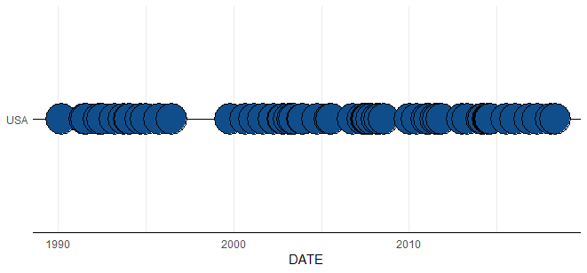
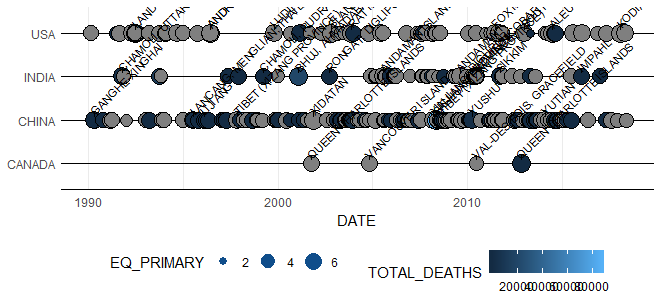
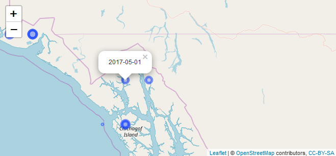
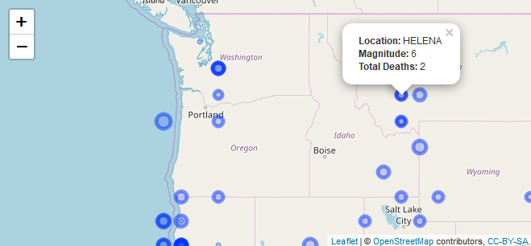

<!-- README.md is generated from README.Rmd. Please edit that file -->
[](https://travis-ci.com/seewilds/timelineR)

timelineR README
----------------

timelineR is an extension of the ggplot2 package, dedicated to the plotting of timeline data.It also includes dedicated download and ceaning functions for the NOAA database of hurricanes.

Download and Cleaning
---------------------

***download\_sed()*** downloads the NOAA database of hurricanes as a data frame.

``` r
all_hurricanes <- download_sed()
head(str(all_hurricanes))
```

***eq\_clean\_data()*** cleans the NOAA data frame by converting the LATTITUDE and LONGITUDE columns to integers, and creates a dedicated DATE column.

``` r
all_hurricanes_clean <- eq_clean_data(all_hurricanes)
str(all_hurricanes_clean)
```

***eq\_location\_clean()*** cleans the Location column of the NOAA data frame.

``` r
final_hurricanes <- eq_location_clean(all_hurricanes_clean)
str(final_hurricanes)
```

geom\_timeline
--------------

***geom\_timeline()*** creates a ggplot object that plots instances of an event over time.

``` r
usa_hurricanes <- final_hurricanes%>%filter(COUNTRY == "USA")
usa_plot <- ggplot(data = usa_hurricanes, aes(DATE, COUNTRY)) 
usa_plot + geom_timeline(aes(xmin =as.Date("1990-01-01"))) +
theme_timeline()
```



geom\_timeline\_label
---------------------

***geom\_timeline\_label()*** generates labels for the plotted event instances.

``` r
data <- final_hurricanes%>%filter(COUNTRY%in%c("USA", "CANADA", "CHINA", "INDIA"))
country_plot <- ggplot(data, aes(DATE, COUNTRY)) 
country_plot <- country_plot + geom_timeline(aes(xmin =as.Date("1990-01-01"), size = EQ_PRIMARY, fill = TOTAL_DEATHS)) 
country_plot <- country_plot + geom_timeline_label(aes(xmin =as.Date("1990-01-01"), label = LOCATION_NAME, n_max = 10, n_max_arrange = EQ_PRIMARY))
country_plot <- country_plot + theme_timeline()
```



Leaflet Mapping
---------------

***eq\_map()*** generates a leaflet map of locations of the NOAA hurricanes.

``` r
eq_map(usa_hurricanes, annot_col = 'DATE')
```



***eq\_create\_label()*** generates an annotation column in the NOAA data frame for use within the leaflet map. 

``` r
usa_hurricanes%>%eq_create_label(.)%>%eq_map(annot_col = 'popup_text')
```
